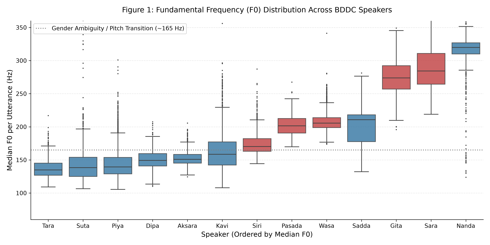
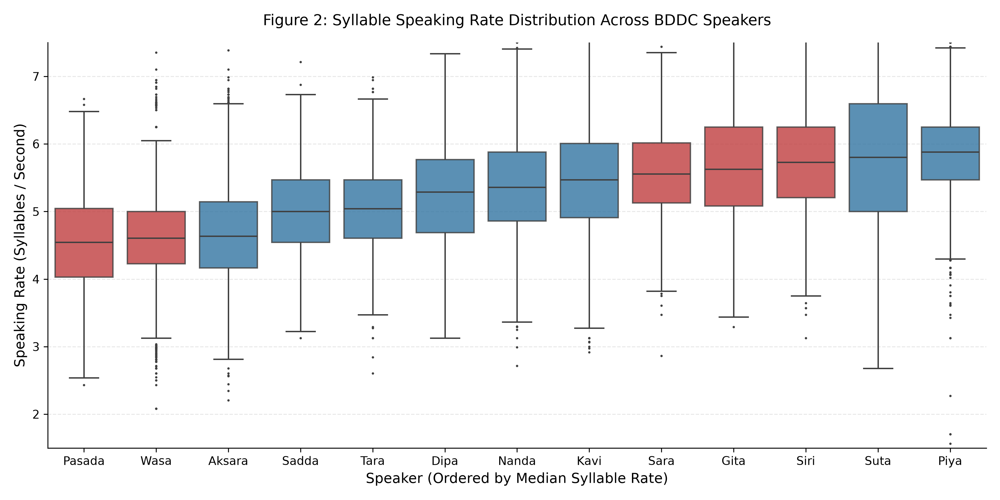
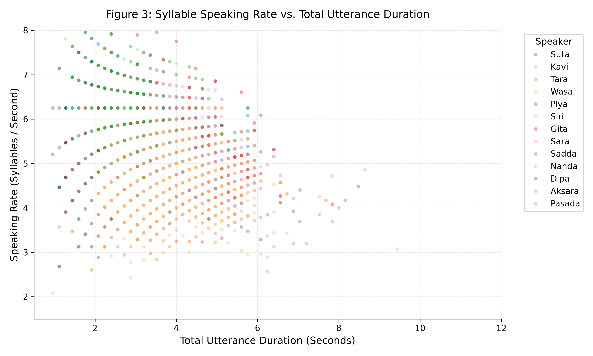
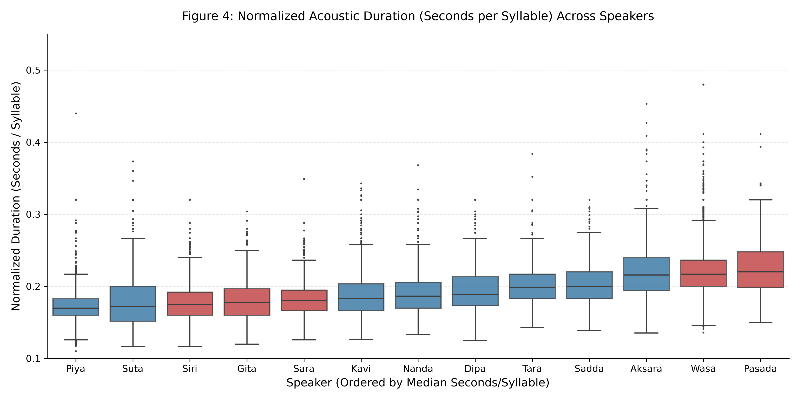
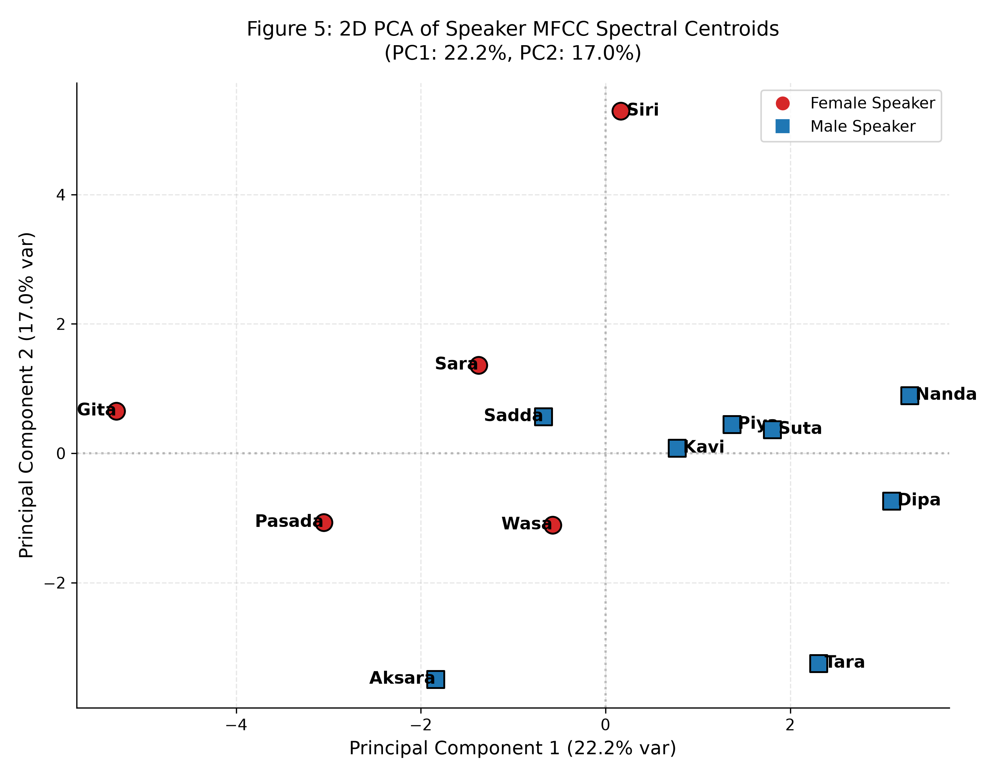
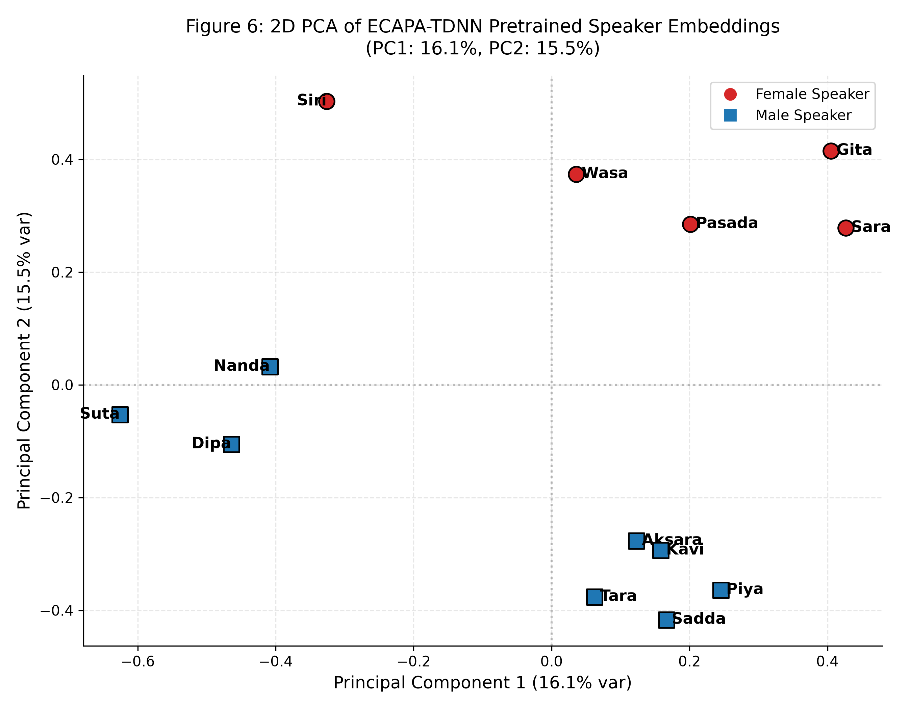
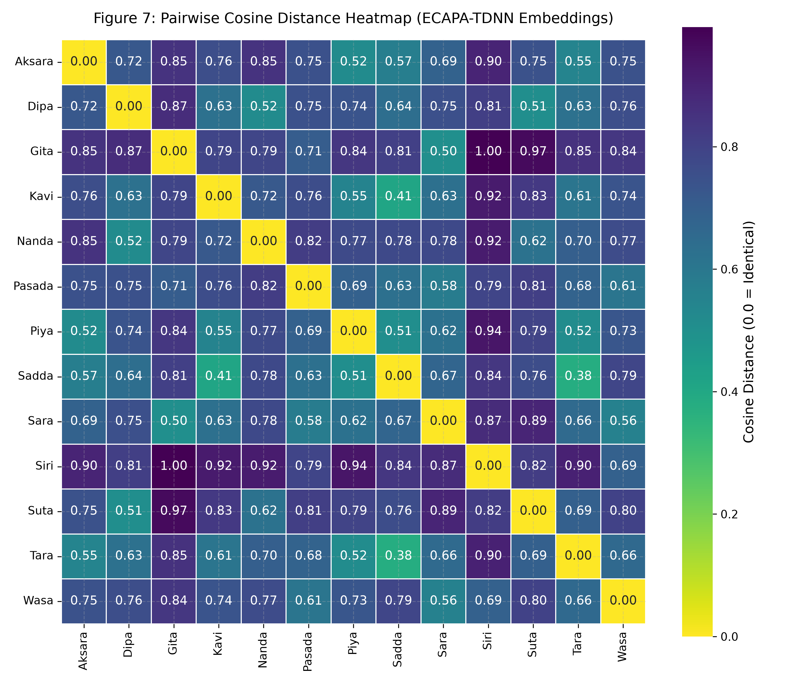
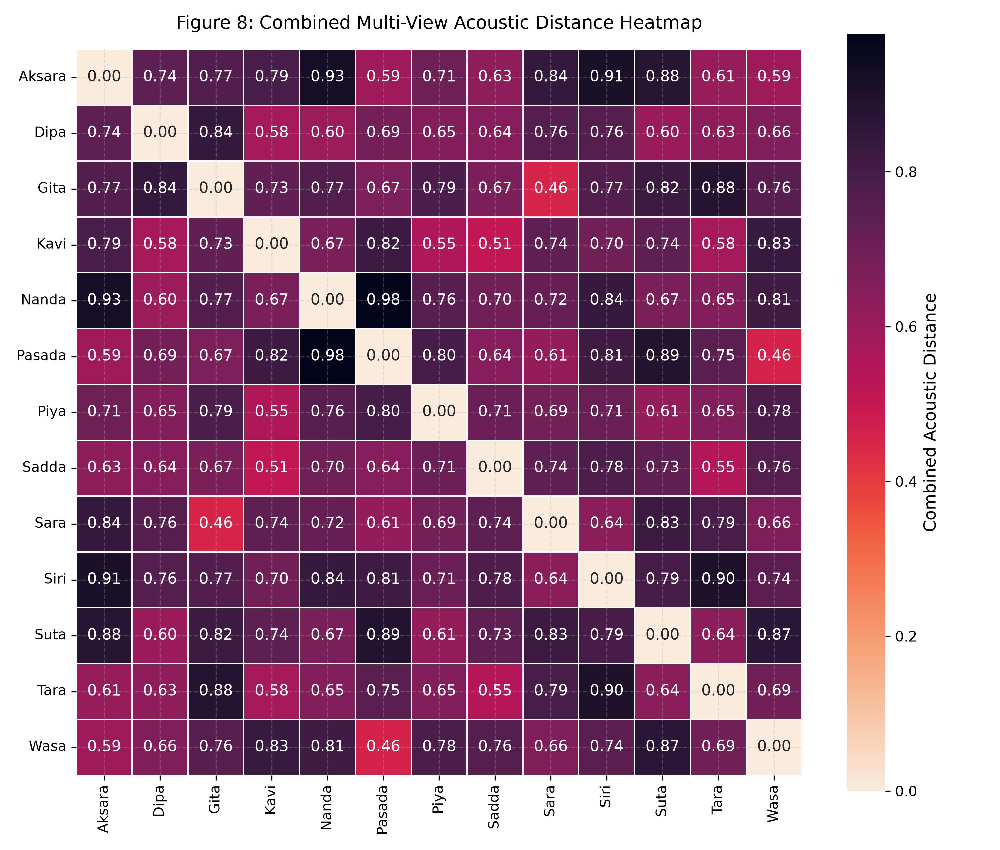
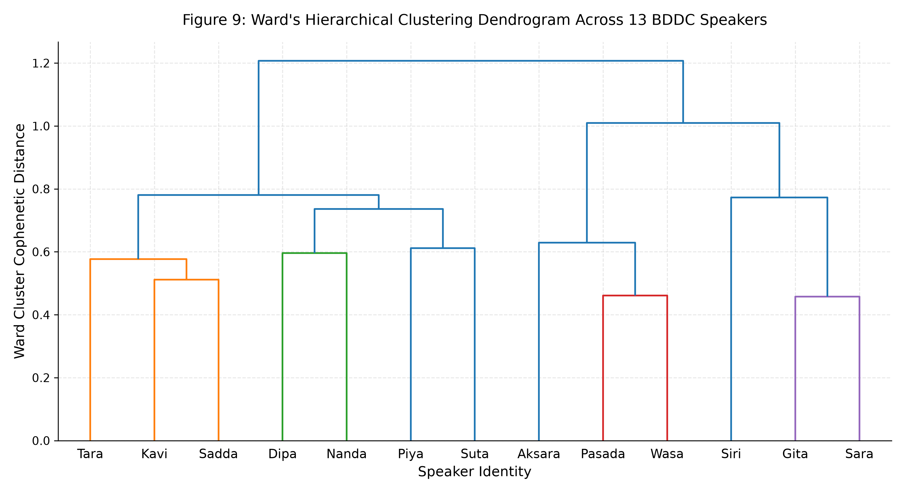

### Burmese Daily Dialogue Corpus (BDDC) — Acoustic Analysis

A comprehensive, publication-grade acoustic and prosodic evaluation of the **Burmese Daily Dialogue Corpus (BDDC)**. This study empirically examines the acoustic separability and character divergence of the **13 synthetic Burmese speakers** across **24,560 audio utterances (~22 hours)**.

---

### Dataset Access

The raw audio files (16 kHz, Mono, 16-bit PCM) and train/validation/test splits are officially hosted on Hugging Face:

[Hugging Face Datasets: thantzinphyo-gg/Open-Burmese-Speech](https://huggingface.co/datasets/thantzinphyo/Burmese-Daily-Dialogue-Corpus)

```python
from datasets import load_dataset

# Stream or download the BDDC dataset directly
dataset = load_dataset("thantzinphyo-gg/Open-Burmese-Speech")
print(dataset)
```

---

### Key Empirical Findings

1. **AAcoustic Separability:** Non-parametric Kruskal–Wallis testing indicates significant differences in fundamental frequency ($F_0$) across the 13 synthetic speakers ($H = 18,194.6$, $p < 10^{-300}$). The estimated Kruskal–Wallis epsilon-squared effect size ($\varepsilon^2 = 0.7407$) indicates a large speaker-associated effect on the observed $F_0$ distributions..
2. **Beyond Simple Pitch Shifting:** Speakers with similar median pitch values (e.g., Piya: 139.5 Hz, Suta: 138.4 Hz, and Tara: 134.9 Hz) nevertheless exhibit differences in MFCC-based spectral characteristics and pretrained ECAPA-TDNN embedding space. These results provide evidence that the observed speaker variation extends beyond differences in fundamental frequency alone.
3. **Independent Speaking Styles & Prosody:** Speaking rate varies across the synthetic speakers, ranging from 4.55 syllables/s for Pasada to 5.88 syllables/s for Piya. The estimated effect size ($\varepsilon^2 = 0.3779$) indicates substantial between-speaker differences in the observed speaking-rate distributions.
4. **Generalization Value:** The held-out test speakers, Gita and Nanda, occupy distinct regions of the analyzed acoustic feature spaces. This provides evidence that the test speakers introduce additional acoustic variation and can be used to evaluate speaker generalization in ASR and related speech-processing experiments.

---

## Summary Tables

### Table 1: Comprehensive Speaker Acoustic Profiles

| Speaker | Voice Type | Median $F_0$ (Hz) | $F_0$ Range (Hz) | Speech Rate (syll/s) | Median Duration (s) | MFCC Position | Embedding Cluster |
| :--- | :--- | :---: | :---: | :---: | :---: | :---: | :---: |
| **Aksara** | Male | 150.99 | 90.51 | 4.63 | 2.72 | Spectral Group B | Cluster 3 |
| **Dipa** | Male | 149.43 | 74.93 | 5.29 | 2.08 | Spectral Group A | Cluster 2 |
| **Gita** | Female *(Held-Out Test)* | 273.98 | 166.61 | 5.63 | 4.32 | Spectral Group B | Cluster 4 |
| **Kavi** | Male | 158.54 | 265.18 | 5.47 | 3.20 | Spectral Group A | Cluster 1 |
| **Nanda** | Male *(Held-Out Test)* | 319.88 | 287.15 | 5.36 | 3.20 | Spectral Group A | Cluster 2 |
| **Pasada** | Female | 201.51 | 112.35 | 4.55 | 4.48 | Spectral Group B | Cluster 3 |
| **Piya** | Male | 139.51 | 156.23 | 5.88 | 2.72 | Spectral Group A | Cluster 2 |
| **Sadda** | Male | 210.73 | 278.27 | 5.00 | 3.04 | Spectral Group B | Cluster 1 |
| **Sara** | Female | 284.36 | 222.87 | 5.56 | 4.16 | Spectral Group B | Cluster 4 |
| **Siri** | Female | 170.31 | 129.38 | 5.73 | 2.08 | Spectral Group A | Cluster 4 |
| **Suta** | Male | 138.36 | 229.05 | 5.80 | 2.08 | Spectral Group A | Cluster 2 |
| **Tara** | Male | 134.90 | 336.94 | 5.04 | 3.36 | Spectral Group A | Cluster 1 |
| **Wasa** | Female | 205.62 | 97.08 | 4.61 | 3.52 | Spectral Group B | Cluster 3 |

---

### Table 2: Pairwise Distance Analysis

The multi-view acoustic distance integrates **Voice Identity** (ECAPA-TDNN $35\%$ + MFCC $25\%$), **Pitch Dynamics** ($F_0$ Euclidean $20\%$), and **Prosodic Rhythm** (Speaking Rate & Duration $20\%$):

#### Closest Speaker Pairs
| Pair | Combined Distance | Embedding Cosine Distance | MFCC Distance | Primary Evidence |
| :--- | :---: | :---: | :---: | :--- |
| **Gita ↔ Sara** | 0.458 | 0.503 | 0.853 | ECAPA-TDNN Embedding + MFCC Spectral |
| **Pasada ↔ Wasa** | 0.461 | 0.609 | 0.819 | ECAPA-TDNN Embedding + MFCC Spectral |
| **Kavi ↔ Sadda** | 0.512 | 0.409 | 0.902 | ECAPA-TDNN Embedding + MFCC Spectral |
| **Sadda ↔ Tara** | 0.546 | 0.379 | 1.279 | MFCC Spectral + $F_0$ Pitch |
| **Kavi ↔ Piya** | 0.554 | 0.549 | 0.935 | ECAPA-TDNN Embedding + MFCC Spectral |

*The ECAPA-TDNN embedding distances show substantial acoustic separation among the analyzed speakers. The closest pair in the combined acoustic analysis (Gita ↔ Sara; combined distance = 0.458) still exhibits measurable differences across the embedding, MFCC, pitch, and prosodic feature spaces. These distances should be interpreted as relative acoustic similarity within this dataset rather than as a universal speaker-verification threshold.*

#### Most Distant Speaker Pairs
| Pair | Combined Distance | Embedding Cosine Distance | MFCC Distance | Primary Evidence |
| :--- | :---: | :---: | :---: | :--- |
| **Nanda ↔ Pasada** | 0.978 | 0.820 | 1.636 | ECAPA-TDNN Embedding + MFCC Spectral + $F_0$ Pitch |
| **Aksara ↔ Nanda** | 0.928 | 0.851 | 1.238 | ECAPA-TDNN Embedding + MFCC Spectral + $F_0$ Pitch |
| **Aksara ↔ Siri** | 0.909 | 0.897 | 1.348 | ECAPA-TDNN Embedding + MFCC Spectral + $F_0$ Pitch |
| **Siri ↔ Tara** | 0.904 | 0.905 | 1.345 | ECAPA-TDNN Embedding + MFCC Spectral + $F_0$ Pitch |
| **Pasada ↔ Suta** | 0.887 | 0.812 | 1.213 | ECAPA-TDNN Embedding + MFCC Spectral + $F_0$ Pitch |

---

### Visual Gallery

### Figure 1: Fundamental Frequency ($F_0$) Distribution


### Figure 2: Syllable Speaking Rate Distribution


### Figure 3: Speaking Rate vs. Utterance Duration


### Figure 4: Normalized Acoustic Duration (Sec/Syllable)


### Figure 5: 2D PCA of MFCC Spectral Centroids


### Figure 6: 2D PCA of Pretrained ECAPA-TDNN Embeddings


### Figure 7: ECAPA-TDNN Cosine Distance Heatmap


### Figure 8: Combined Multi-View Acoustic Distance Heatmap


### Figure 9: Ward's Hierarchical Clustering Dendrogram


---

### Reproducibility

### Installation
```bash
git clone https://github.com/thantzinphyo-gg/BDDC-Acoustic-Analysis.git
cd BDDC-Acoustic-Analysis
pip install -r requirements.txt
```

### Run Analysis Pipeline
```bash
python run_acoustic_analysis.py
```

### Interactive Notebook
Explore the step-by-step analysis, statistical models, and plots interactively:
```bash
jupyter notebook bddc_acoustic_analysis.ipynb
```

---

### Citation

If you use BDDC or this acoustic analysis in your research, please cite:

```bibtex

@misc{bddc_corpus_2026,
  author       = {Thant Zin Phyo},
  title        = {Burmese Daily Dialogue Corpus (BDDC)},
  year         = {2026},
  publisher    = {Hugging Face},
  howpublished = {\url{https://huggingface.co/datasets/thantzinphyo/Burmese-Daily-Dialogue-Corpus}}
}
```

### Author & Contact

* **Author:** Thant Zin Phyo
* **Hugging Face:** [@thantzinphyo](https://huggingface.co/thantzinphyo)
* **GitHub:** [@thantzinphyo-gg](https://github.com/thantzinphyo-gg)
